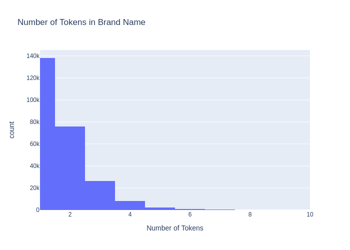

# Open-Brand: Open Brand Value Extraction from Product Descriptions

The dataset contains over 250k product brand-value annotations with more than 50k unique values across eight main categories of Amazon product profiles. For more details, refer to our [ACL-ECNLP 2022 paper](https://aclanthology.org/2022.ecnlp-1.19/).

The dataset is in [JSON Lines](https://jsonlines.org/) format, with the following schema:

```
{
   "asin": <product unique id>,
   "category": <category name>,
    "description": <product description text>,
    "brand": <brand value inside description text>,
    "tag": [list of tagged product descriptions for NER]
}
```
The 'asin' product id is the same as in the `All_Amazon_Meta.json` file in the [Amazon Review Data (2018)](https://nijianmo.github.io/amazon/index.html). To obtain the full version of the dataset see [below](#obtaining-the-dataset).

The json object contains a tagged product with the relevant Brand. An example is shown as follows:

```
{
   "asin": "B07ZNDB9RG",
   "category": "Toys and Games",
   "description": "Wooden Stacking Board Games 54 Pieces
   for Kids Adult and Families, Gentle Monster Wooden Blocks Toys for Toddlers, Colored Building Blocks - 6 Colors 2 Dice"
   "brand": "Gentle Monster"
   "tag": ["O", "O", "O", "O", "O", "O", "O", "O", "O", "O", "O", "B-Brand", "I-Brand", "O", "O", "O", "O", "O",...]
}
```

## Data Description
The following table shows the statistics of all of our dataset:

<center>
    
| Category                     | Number of Samples |
|------------------------------|-------------------|
| Automotive                   | 66837             |
| Cell Phones and Accessories  | 78564             |
| Clothing, Shoes, and Jewelry | 85068             |
| Electronics                  | 47870             |
| Grocery and Gourmet Food     | 22397             |
| Pet Supplies                 | 10868             |
| Sports and Outdoors          | 54214             |
| Toys and Games               | 63304             |

</center>

The following graph shows the number of tokens that constitute a brand inside the main dataset:

<center>

</center>

## Obtaining the Dataset
1. Clone the repo
2. Gain access to the [Amazon Review Data (2018)](https://nijianmo.github.io/amazon/index.html) and download the `All_Amazon_Meta.json` file to the folder of this repo.
3. Run script
    ```
    bash ./extract_data.sh
    ```
    
The above shell script runs the python script `extract_data.py` which uses  an [apache beam](https://beam.apache.org/) pipeline to process the data.

The output of the full datasets will be stored in the `datasets/` folder as a json file. The produced datasets are `az_base_dataset.jsonl` and `az_new_cat_dataset.jsonl` respectively. 

## Reading the Data in DataFrames 
A simple script to read any of the produced [JSON Lines](https://jsonlines.org/) data in `datasets/` directory as [pandas](https://pandas.pydata.org/) dataframe:

```
import json
import pandas as pd

def getDF(path):
   with open('path') as f:
      i = 0
      df = {}
      for line in f:
         df[i] = json.loads(line)
         i += 1
   return pd.DataFrame.from_dict(df, orient='index')
   
df = getDF('datasets/az_base_dataset.jsonl')

```
------

If you found this work useful or used the datasets, please cite it as follows:

```
@inproceedings{sabeh-etal-2022-openbrand,
    title = "{O}pen{B}rand: Open Brand Value Extraction from Product Descriptions",
    author = "Sabeh, Kassem  and
      Kacimi, Mouna  and
      Gamper, Johann",
    booktitle = "Proceedings of the Fifth Workshop on e-Commerce and NLP (ECNLP 5)",
    month = may,
    year = "2022",
    address = "Dublin, Ireland",
    publisher = "Association for Computational Linguistics",
    url = "https://aclanthology.org/2022.ecnlp-1.19",
    doi = "10.18653/v1/2022.ecnlp-1.19",
    pages = "161--170",
}
```
